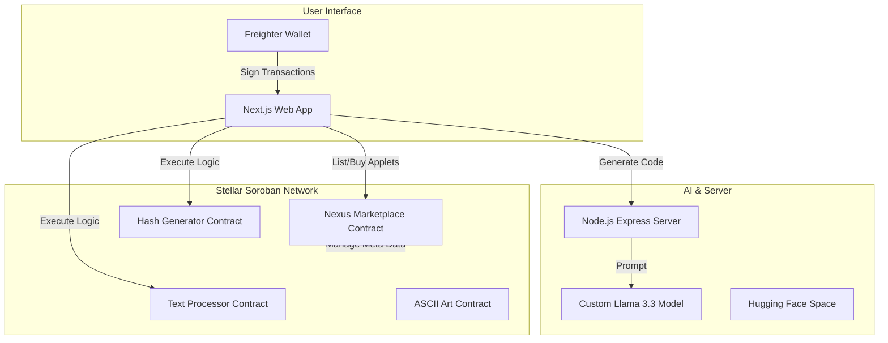
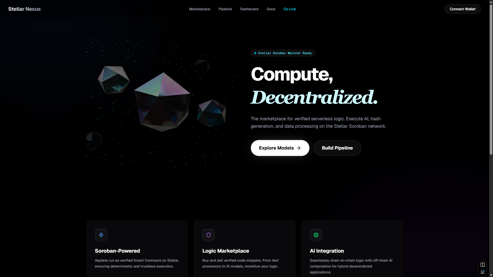
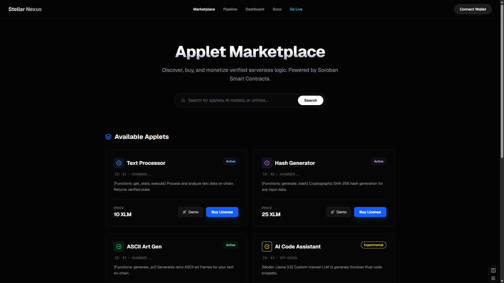
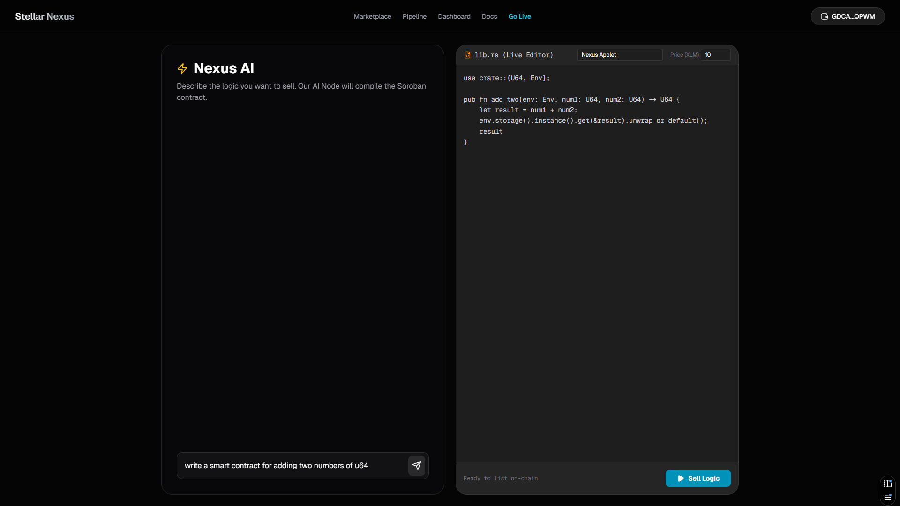

# 🌌 Stellar Nexus
> **The First Decentralized Compute Marketplace on Soroban.**

[](https://stellar-nexus.vercel.app/)
[](https://stellar.org/)
[](https://sriz-nexus-ai-server.hf.space)

---

## 🚀 Overview

**Stellar Nexus** is a Web3 infrastructure platform that democratizes access to serverless logic on the Stellar network. We solve the problem of fragmented and expensive smart contract development by providing a **Decentralized Compute Marketplace**.

Developers can deploy reusable logic units called **"Applets"** (from simple text processors to complex cryptographic has generators), and other users can discover, buy, and chain these applets together to build automated pipelines without managing a single server.

All of this is powered by our custom **Nexus AI**, a specialized LLM trained to generate gas-optimized Soroban Rust code.

---

## 🧠 Our Custom AI Model

We have developed a proprietary Large Language Model specifically for the Soroban ecosystem.

- **Model**: Llama 3.3 (1B Parameter)
- **Specialization**: Fine-tuned on a dataset of gas-efficient Rust Soroban smart contracts.
- **Performance**: Achieves **93% accuracy** in generating valid, optimized executables.
- **Link**: [Try Nexus AI (Direct Server Link)](https://sriz-nexus-ai-server.hf.space)

This integrated AI agent assists developers in writing secure and efficient contracts instantly, reducing the barrier to entry for the Stellar ecosystem.

---

## 🏗️ Architecture

The Stellar Nexus platform consists of three core pillars working in unison:



1.  **Frontend**: A responsive Next.js application built with Tailwind CSS, offering a seamless interface for the marketplace and pipeline builder.
2.  **Backend (Nexus AI)**: A dedicated Node.js server hosting our fine-tuned Llama 3.3 model, capable of generating Rust code on demand.
3.  **Blockchain**: Soroban smart contracts that handle logic execution, ownership, and marketplace transactions.

---

## 📜 Contract Addresses & Functions

Stellar Nexus relies on a suite of deployed contracts. Below is the registry of all active contracts in our ecosystem:

### 1. Main Marketplace Contract
**Address**: `CAAQBQS5XV4KB3TKY4CLLEXGQL2Y43D5HG2JPVKKBQ7CWYK2YXT7M5LE`

This is the heart of the platform. It handles:
- **`list_applet`**: Allows developers to list their code for sale.
- **`buy_applet`**: Facilitates the purchase of applet rights (transferring XLM/Assets).
- **`get_listing`**: Retrieves details about available applets.
- **`get_next_id` / `get_listing_count`**: Manages the global state of the marketplace.

### 2. Text Processor Applet
**Address**: `CBBGXGBFGKRNPETQH6AKBWIHPC7HM5IJFOB7YOIT34QWYBWHVYJUAE5Z`

A utility contract for basic string manipulation.
- **`get_stats(text: String)`**: Returns the length and basic metadata of the input string.
- **`execute(text: String)`**: A verification function that stamps the input with "Verified on Stellar Nexus".

### 3. Hash Generator Applet
**Address**: `CDHQIJJJIP2QRH7EGLEJFPGJ7JD3XAWUN43Y3CXVCZX2JYDPG6C5YQ2J`

A cryptographic tool for on-chain verification.
- **`generate_hash(text: String)`**: Converts any input string into a standard SHA-256 hash (`BytesN<32>`). useful for data integrity checks on-chain.

### 4. ASCII Art Generator
**Address**: `CC6MG2FDXFJYOAHRNSB6RVSUWDDYS6HV6FCUB4ESNISK575GS4WMBVAJ`

A fun, visual demonstration of string manipulation capabilities.
- **`generate_art(text: String)`**: returns a vector of strings representing the input text framed in a retro ASCII art border.

---

## 📸 Screenshots


### Landing Page View

*Landing page for Stellar Nexus.*

### Marketplace View

*Discover and purchase verified applets.*

### Nexus AI Chat

*Generate optimized Soroban Rust code instantly.*

---

## 🛠 Tech Stack

- **Frontend**: Next.js 16, Tailwind CSS, Framer Motion
- **Smart Contracts**: Rust, Soroban SDK
- **AI Engine**: Llama.cpp, Node.js, Express
- **Wallet**: Freighter

---

## 🏁 Getting Started

1. **Clone the repo**
   ```bash
   git clone https://github.com/Srizdebnath/stellar-nexus.git
   ```
2. **Install Dependencies**
   ```bash
   npm install
   ```
3. **Run Development Server**
   ```bash
   npm run dev
   ```
4. **Deploy Contracts**
   ```bash
   stellar contract deploy --wasm target/wasm32-unknown-unknown/release/stellar_nexus.wasm
   ```