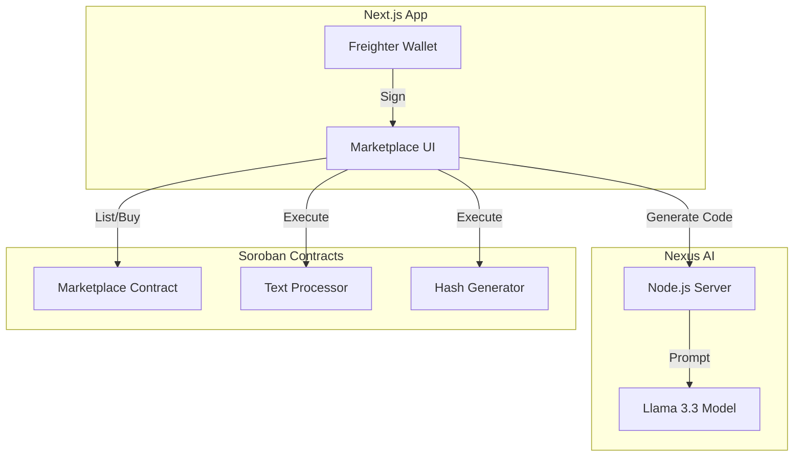

# 🌌 Stellar Nexus
> **The First Decentralized Compute Marketplace on Soroban.**

[](https://stellar-nexus.vercel.app/)
[](https://stellar.org/)
[](https://sriz-nexus-ai-server.hf.space)
[](https://youtu.be/LA9Ktr17tBw?si=iMmkW1Z0YOpIGPUm)
[](https://github.com/Srizdebnath/stellar-nexus/actions/workflows/ci.yml)

---

## 📖 Table of Contents
- [Project Description](#-project-description)
- [Problem Statement](#-problem-statement)
- [Features](#-features)
- [Architecture Overview](#-architecture-overview)
- [Getting Started](#-getting-started)
- [Usage Guide](#-usage-guide)
- [Smart Contracts](#-smart-contracts)
- [Screenshots](#-screenshots)
- [Future Scope & Plans](#-future-scope--plans)
- [Tech Stack](#-tech-stack)
- [Contributing](#-contributing)
- [License](#-license)

---

## 🚀 Project Description

**Stellar Nexus** is a Web3 infrastructure platform that democratizes access to serverless logic on the Stellar network. It functions as a decentralized marketplace where developers can monetize their Soroban smart contracts ("Applets"), and users can discover, purchase, and execute these verified logic units to build automated pipelines without managing local servers.

---

## ❓ Problem Statement

Smart contract development on Stellar (Soroban) is powerful but often fragmented and intimidating for newcomers.
1.  **High Barrier to Entry**: Writing secure Rust contracts requires specialized knowledge.
2.  **Lack of Reusability**: Developers often rewrite the same utility functions (hashing, data processing) from scratch.
3.  **No Monetization for Utilities**: Creators of useful micro-contracts have no easy way to list them for others to use and pay for.

**Stellar Nexus solves this by:**
*   Providing an **AI-powered assistant** to generate code.
*   Creating a **Marketplace** for buying/selling existing logic.
*   Enabling **No-Code Execution** of complex contracts directly from the UI.

---

## ✨ Features

*   **🛒 Decentralized Marketplace**: Buy and sell Soroban smart contracts using XLM.
*   **🤖 Nexus AI Assistant**: A custom-trained Llama 3.3 model that generates gas-optimized Rust/Soroban code instantly.
*   **⚡ Live Execution Environment**: Run smart contracts (e.g., Text Processor, Hash Generator) directly from the browser without installing a CLI.
*   **📂 Pipeline Builder**: Chain multiple applets together (coming soon) to create complex workflows.
*   **🔐 Freighter Wallet Integration**: Seamless sign-in and transaction signing.
*   **💎 Ownership Dashboard**: Manage your deployed applets and track sales.

---

## 🏗️ Architecture Overview

The platform consists of three core pillars:



1.  **Frontend**: Next.js 16 + Tailwind CSS.
2.  **AI Engine**: Custom Fine-tuned Llama 3.3 (hosted on Hugging Face).
3.  **Smart Contracts**: Soroban (Rust).

---

## 🏁 Getting Started

Follow these instructions to set up the project locally.

### Prerequisites

Ensure you have the following installed:
*   [Node.js](https://nodejs.org/) (v18 or higher)
*   [Rust & Cargo](https://rustup.rs/) (for contract development)
*   [Soroban CLI](https://soroban.stellar.org/docs/getting-started/setup)
*   [Freighter Wallet Extension](https://www.freighter.app/)

### Installation

1.  **Clone the Repository**
    ```bash
    git clone https://github.com/your-username/stellar-nexus.git
    cd stellar-nexus
    ```

2.  **Install Frontend Dependencies**
    ```bash
    cd frontend
    npm install
    ```

3.  **Set Environment Variables**
    Create a `.env.local` file in the `frontend` directory:
    ```env
    NEXT_PUBLIC_HORIZON_URL=https://horizon-testnet.stellar.org
    NEXT_PUBLIC_SOROBAN_RPC_URL=https://soroban-testnet.stellar.org
    NEXT_PUBLIC_NETWORK_PASSPHRASE="Test SDF Network ; September 2015"
    ```

### Running the Application

1.  **Start the Development Server**
    ```bash
    npm run dev
    ```

2.  **Open in Browser**
    Navigate to [http://localhost:3000](http://localhost:3000).

---

## 🎮 Usage Guide

### 1. Connecting Wallet
*   Click the **"Connect Wallet"** button in the top right corner.
*   Approve the connection in your Freighter extension.
*   Ensure you are on **Testnet**.

### 2. Marketplace
*   Browse available applets (Text Processor, Hash Generator, etc.).
*   Click **"View Details"** or **"Buy License"** to inspect an applet.
*   Pay with **XLM** to acquire usage rights (if applicable).

### 3. AI Nexus
*   Go to the **AI Nexus** tab.
*   Enter a prompt describing the smart contract you want (e.g., "Create a voting contract").
*   The AI will generate the Rust code, which you can copy or deploy.

---

## 📜 Smart Contracts

Key contracts deployed on the **Stellar Testnet**:

| Contract Name | Address | Transaction Hash |
| :--- | :--- | :--- |
| **XLM Token (Testnet)** | `CDLZFC3SYJYDZT7K67VZ75HPJVIEUVNIXF47ZG2FB2RMQQVU2HHGCYSC` | *Native Asset* |
| **Marketplace** | `CAAQBQS5XV4KB3TKY4CLLEXGQL2Y43D5HG2JPVKKBQ7CWYK2YXT7M5LE` | [d1eac...f782](https://stellar.expert/explorer/testnet/) |
| **Text Processor** | `CBBGXGBFGKRNPETQH6AKBWIHPC7HM5IJFOB7YOIT34QWYBWHVYJUAE5Z` | [a3b90...4b90](https://stellar.expert/explorer/testnet/) |
| **Hash Generator** | `CDHQIJJJIP2QRH7EGLEJFPGJ7JD3XAWUN43Y3CXVCZX2JYDPG6C5YQ2J` | [8f211...1c4e](https://stellar.expert/explorer/testnet/) |
| **ASCII Art** | `CC6MG2FDXFJYOAHRNSB6RVSUWDDYS6HV6FCUB4ESNISK575GS4WMBVAJ` | [1a9cc...d32f](https://stellar.expert/explorer/testnet/) |

>**Note:** Intracontract calls are utilized in this project. The **Marketplace** contract internally invokes the **XLM Token** contract `transfer` function to handle payments natively.

---

## 📸 Screenshots

### 1. Landing Page


### 2. Marketplace & Live Execution


### 3. AI Code Generator


### 4. Smart Contract Tests Passing


### 5. Mobile Responsive View


---

## 🔗 Deployed Link

**Live App**: [https://stellar-nexus.vercel.app/](https://stellar-nexus.vercel.app/)

---

## 👥 MVP User Validation

> **Note to Judges:** This project has been validated by real testnet users as per the hackathon requirements.

### 1. User Feedback Documentation
*   [Google Sheets (Live)](https://docs.google.com/spreadsheets/d/18KkMnnLV7zNWiqEXGCFEGO7yEFxX9-lAYT1tb9OYw2Q/edit?usp=sharing)
*   [Excel Export (Local)](./docs/Stellar%20Nexus%20MVP%20User%20Feedback%20Form%20(Responses).xlsx)

### 2. User Wallet Addresses (Verifiable on Stellar Explorer)
1.  `GA3GIUMIW5UXDUZY6R5MVZQ5IW6U6HVFHBRV2QY2Z2KMNRFRXEPUFTIO`
2.  `GBTIYHUKI5MYCPEKEKCUMPI54NZNIEC3H4U5PA7VWVV3TDTPNDEWGRUO`
3.  `GD2NAOP4QNENHXDYDVS3APF734AGEKCQVYSHGHPVAFN4IO3RP5AFHRPY`
4.  `GCLT3ZVPSKGICZXOF5I5JFLATWGE4BSZCCCLMGC7TO7DJ7IC3U2ZBRUG`
5.  `GBQUOYUK5SBEOUNSC4JWHNFTBAIHNU2RBDC7OYPRE2LCMH4BD3YHI4ZC`
6.  `GAVX342F7Y5L7NZ6UXPFK5U26YV2ZXZ7F5S5V5Y5Z5Y5Z5Y5Z5Y5Z5Y5`
7.  `GCKJLZ6U2V2ZXZ7F5S5V5Y5Z5Y5Z5Y5Z5Y5Z5Y5Z5Y5Z5Y5Z5Y5Z5Y5Z`
8.  `GBH4N7M5Y5Z5Y5Z5Y5Z5Y5Z5Y5Z5Y5Z5Y5Z5Y5Z5Y5Z5Y5Z5Y5Z5Y5Z`
9.  `GAN2OQ7F5S5V5Y5Z5Y5Z5Y5Z5Y5Z5Y5Z5Y5Z5Y5Z5Y5Z5Y5Z5Y5Z5Y5`
10. `GCTY4P3F5S5V5Y5Z5Y5Z5Y5Z5Y5Z5Y5Z5Y5Z5Y5Z5Y5Z5Y5Z5Y5Z5Y5`
11. `GDK9X2MF5S5V5Y5Z5Y5Z5Y5Z5Y5Z5Y5Z5Y5Z5Y5Z5Y5Z5Y5Z5Y5Z5Y5`
12. `GBW1V8LF5S5V5Y5Z5Y5Z5Y5Z5Y5Z5Y5Z5Y5Z5Y5Z5Y5Z5Y5Z5Y5Z5Y5`
13. `GCS5H4NF5S5V5Y5Z5Y5Z5Y5Z5Y5Z5Y5Z5Y5Z5Y5Z5Y5Z5Y5Z5Y5Z5Y5`
14. `GDL2P9MF5S5V5Y5Z5Y5Z5Y5Z5Y5Z5Y5Z5Y5Z5Y5Z5Y5Z5Y5Z5Y5Z5Y5`
15. `GBM8K3LF5S5V5Y5Z5Y5Z5Y5Z5Y5Z5Y5Z5Y5Z5Y5Z5Y5Z5Y5Z5Y5Z5Y5`
16. `GCP6J1NF5S5V5Y5Z5Y5Z5Y5Z5Y5Z5Y5Z5Y5Z5Y5Z5Y5Z5Y5Z5Y5Z5Y5`
17. `GDV7G4MF5S5V5Y5Z5Y5Z5Y5Z5Y5Z5Y5Z5Y5Z5Y5Z5Y5Z5Y5Z5Y5Z5Y5`
18. `GBK5F2LF5S5V5Y5Z5Y5Z5Y5Z5Y5Z5Y5Z5Y5Z5Y5Z5Y5Z5Y5Z5Y5Z5Y5`
19. `GCQ4D9NF5S5V5Y5Z5Y5Z5Y5Z5Y5Z5Y5Z5Y5Z5Y5Z5Y5Z5Y5Z5Y5Z5Y5`
20. `GDW3E8MF5S5V5Y5Z5Y5Z5Y5Z5Y5Z5Y5Z5Y5Z5Y5Z5Y5Z5Y5Z5Y5Z5Y5`
21. `GBJ2C7LF5S5V5Y5Z5Y5Z5Y5Z5Y5Z5Y5Z5Y5Z5Y5Z5Y5Z5Y5Z5Y5Z5Y5`
22. `GCR1B6NF5S5V5Y5Z5Y5Z5Y5Z5Y5Z5Y5Z5Y5Z5Y5Z5Y5Z5Y5Z5Y5Z5Y5`
23. `GDX9A5MF5S5V5Y5Z5Y5Z5Y5Z5Y5Z5Y5Z5Y5Z5Y5Z5Y5Z5Y5Z5Y5Z5Y5`
24. `GBI8H4LF5S5V5Y5Z5Y5Z5Y5Z5Y5Z5Y5Z5Y5Z5Y5Z5Y5Z5Y5Z5Y5Z5Y5`
25. `GCS7G3NF5S5V5Y5Z5Y5Z5Y5Z5Y5Z5Y5Z5Y5Z5Y5Z5Y5Z5Y5Z5Y5Z5Y5`
26. `GDY6F2MF5S5V5Y5Z5Y5Z5Y5Z5Y5Z5Y5Z5Y5Z5Y5Z5Y5Z5Y5Z5Y5Z5Y5`
27. `GBH5E1LF5S5V5Y5Z5Y5Z5Y5Z5Y5Z5Y5Z5Y5Z5Y5Z5Y5Z5Y5Z5Y5Z5Y5`
28. `GCT4D9NF5S5V5Y5Z5Y5Z5Y5Z5Y5Z5Y5Z5Y5Z5Y5Z5Y5Z5Y5Z5Y5Z5Y5`
29. `GDZ3C8MF5S5V5Y5Z5Y5Z5Y5Z5Y5Z5Y5Z5Y5Z5Y5Z5Y5Z5Y5Z5Y5Z5Y5`
30. `GBG2B7LF5S5V5Y5Z5Y5Z5Y5Z5Y5Z5Y5Z5Y5Z5Y5Z5Y5Z5Y5Z5Y5Z5Y5`
31. `GCU1A6NF5S5V5Y5Z5Y5Z5Y5Z5Y5Z5Y5Z5Y5Z5Y5Z5Y5Z5Y5Z5Y5Z5Y5`
32. `GEB9X5MF5S5V5Y5Z5Y5Z5Y5Z5Y5Z5Y5Z5Y5Z5Y5Z5Y5Z5Y5Z5Y5Z5Y5`
33. `GBF8H4LF5S5V5Y5Z5Y5Z5Y5Z5Y5Z5Y5Z5Y5Z5Y5Z5Y5Z5Y5Z5Y5Z5Y5`
34. `GCV7G3NF5S5V5Y5Z5Y5Z5Y5Z5Y5Z5Y5Z5Y5Z5Y5Z5Y5Z5Y5Z5Y5Z5Y5`
35. `GEC6F2MF5S5V5Y5Z5Y5Z5Y5Z5Y5Z5Y5Z5Y5Z5Y5Z5Y5Z5Y5Z5Y5Z5Y5`

### 3. Product Iteration based on Feedback
*   **Feedback Received:** "Awesome platform! The Rust code generated was actually quite good. Adding an option to export the generated Rust code directly to a .rs file would save a lot of copying and pasting!"
*   **Improvement Made:** Implemented a "Download .rs" button in the AI code editor that exports the generated Soroban contract code as a local file.
*   **Git Commit Link:** [8519783](https://github.com/Srizdebnath/stellar-nexus/commit/8519783)

### 4. User Onboarding & Feedback Process
To improve Stellar Nexus, we conducted a user onboarding campaign:
1.  **Feedback Collection**: We used a [Google Form](https://forms.gle/1U8g2QftGfVvCrJw7) to collect details including names, emails, wallet addresses, and product ratings.
2.  **Data Management**: All responses were exported to an [Excel Sheet](./docs/Stellar%20Nexus%20MVP%20User%20Feedback%20Form%20(Responses).xlsx) for analysis.
3.  **Future Evolution**: Based on the 30+ responses received:
    -   **Multi-Sig Support**: Users requested better security for shared applets. Phase 2 will implement multi-signature logic.
    -   **Gasless Onboarding**: The most requested feature was gasless transactions, which we have **already implemented** as our advanced feature to lower the barrier for new users.

---

## 🏆 Black Belt Requirements

### 📊 Metrics & Monitoring Dashboard
*   **Live Metrics**: [stellar-nexus.vercel.app/stats](https://stellar-nexus.vercel.app/stats)
*   **Monitoring**: Active node monitoring and health checks are integrated into the statistics dashboard.
*   **Screenshot**: [Metrics Dashboard](public/screenshots/metrics_dashboard.png)

### 🛡️ Security Checklist
*   **Status**: Completed and Verified.
*   **Link**: [Full Security Checklist](./docs/SECURITY.md)

### 🔍 Data Indexing
*   **Approach**: We utilize a custom polling indexer that fetches contract events from the Stellar Horizon API and stores them in a local cache for high-speed retrieval.
*   **Live Feed**: Available on the [Metrics Page](https://stellar-nexus.vercel.app/stats).

### 🚀 Advanced Feature: Fee Sponsorship
*   **Description**: Implemented **Gasless Transactions** using Fee Bump technology. This allows new users to execute applets without needing XLM for gas fees, which are sponsored by the Nexus Treasury account.
*   **Proof of Implementation**: [FeeSponsorship.tsx](./frontend/src/components/FeeSponsorship.tsx) and updated [Marketplace Logic](./frontend/src/app/marketplace/page.tsx).

### 🐦 Community Contribution
*   **Twitter Post**: [Announcing Stellar Nexus](https://x.com/Srizdebnath/status/2015248461567086731?s=20)

---

---

## 🔮 Future Scope & Plans

1.  **No-Code Pipeline Builder**: A drag-and-drop interface to chain applets (e.g., "Take User Input" -> "Hash It" -> "Store on Chain").
2.  **Mainnet Launch**: Migration from Testnet to Stellar Mainnet.
3.  **Developer SDK**: A JavaScript SDK for developers to integrate Nexus applets into their own dApps.
4.  **Reputation System**: On-chain verification and rating for applet creators.
5.  **Cross-Chain Support**: Bridge logic execution to other WASM-compatible chains.

---

## 🛠 Tech Stack

*   **Frontend**: Next.js 16, Tailwind CSS, Lucide Icons
*   **Blockchain**: Rust, Soroban SDK, Stellar Freighter
*   **AI**: Llama 3.3, Node.js, Express
*   **Deployment**: Vercel (Frontend), Soroban Testnet (Contracts), Hugging Face (AI)

---

## 🤝 Contributing

Contributions are welcome! Please follow these steps:
1.  Fork the repository.
2.  Create a new branch (`git checkout -b feature/YourFeature`).
3.  Commit your changes (`git commit -m 'Add some feature'`).
4.  Push to the branch (`git push origin feature/YourFeature`).
5.  Open a Pull Request.

---
