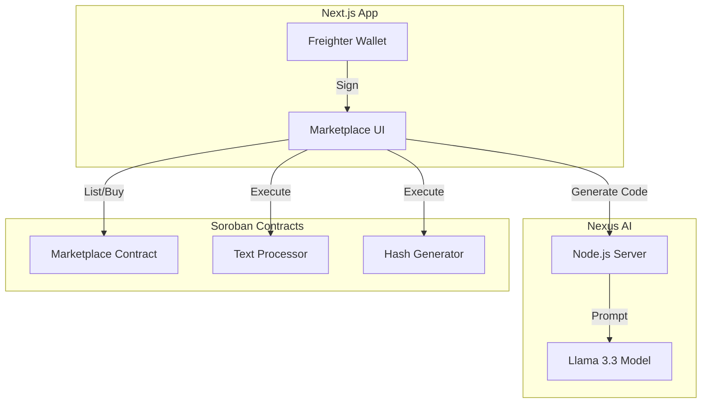
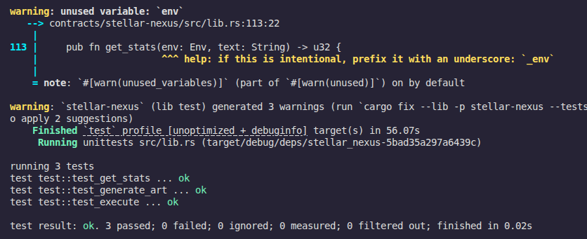
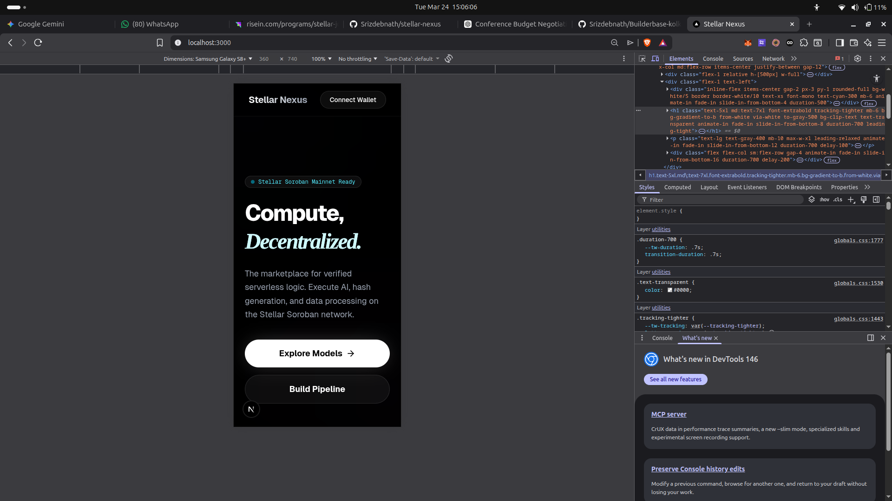

<div align="center">
  
</div>

# 🌌 Stellar Nexus
> **The First Decentralized Compute Marketplace on Soroban.**

[](https://stellar-nexus.vercel.app/)
[](https://stellar.org/)
[](https://sriz-nexus-ai-server.hf.space)
[](https://youtu.be/LA9Ktr17tBw?si=iMmkW1Z0YOpIGPUm)
[](https://github.com/Srizdebnath/stellar-nexus/actions/workflows/ci.yml)

---

## 📖 Table of Contents
- [Project Description](#-project-description)
- [Problem Statement](#-problem-statement)
- [Features](#-features)
- [Architecture Overview](#-architecture-overview)
- [Getting Started](#-getting-started)
- [Usage Guide](#-usage-guide)
- [Smart Contracts](#-smart-contracts)
- [Screenshots](#-screenshots)
- [Future Scope & Plans](#-future-scope--plans)
- [Tech Stack](#-tech-stack)
- [Contributing](#-contributing)
- [License](#-license)

---

## 🚀 Project Description

**Stellar Nexus** is a Web3 infrastructure platform that democratizes access to serverless logic on the Stellar network. It functions as a decentralized marketplace where developers can monetize their Soroban smart contracts ("Applets"), and users can discover, purchase, and execute these verified logic units to build automated pipelines without managing local servers.

---

## ❓ Problem Statement

Smart contract development on Stellar (Soroban) is powerful but often fragmented and intimidating for newcomers.
1.  **High Barrier to Entry**: Writing secure Rust contracts requires specialized knowledge.
2.  **Lack of Reusability**: Developers often rewrite the same utility functions (hashing, data processing) from scratch.
3.  **No Monetization for Utilities**: Creators of useful micro-contracts have no easy way to list them for others to use and pay for.

**Stellar Nexus solves this by:**
*   Providing an **AI-powered assistant** to generate code.
*   Creating a **Marketplace** for buying/selling existing logic.
*   Enabling **No-Code Execution** of complex contracts directly from the UI.

---

## ✨ Features

*   **🛒 Decentralized Marketplace**: Buy and sell Soroban smart contracts using XLM.
*   **🤖 Nexus AI Assistant**: A custom-trained Llama 3.3 model that generates gas-optimized Rust/Soroban code instantly.
*   **⚡ Live Execution Environment**: Run smart contracts (e.g., Text Processor, Hash Generator) directly from the browser without installing a CLI.
*   **📂 Pipeline Builder**: Chain multiple applets together (coming soon) to create complex workflows.
*   **🔐 Freighter Wallet Integration**: Seamless sign-in and transaction signing.
*   **💎 Ownership Dashboard**: Manage your deployed applets and track sales.

---

## 🏗️ Architecture Overview

The platform consists of three core pillars:



1.  **Frontend**: Next.js 16 + Tailwind CSS.
2.  **AI Engine**: Custom Fine-tuned Llama 3.3 (hosted on Hugging Face).
3.  **Smart Contracts**: Soroban (Rust).

---

## 🏁 Getting Started

Follow these instructions to set up the project locally.

### Prerequisites

Ensure you have the following installed:
*   [Node.js](https://nodejs.org/) (v18 or higher)
*   [Rust & Cargo](https://rustup.rs/) (for contract development)
*   [Soroban CLI](https://soroban.stellar.org/docs/getting-started/setup)
*   [Freighter Wallet Extension](https://www.freighter.app/)

### Installation

1.  **Clone the Repository**
    ```bash
    git clone https://github.com/your-username/stellar-nexus.git
    cd stellar-nexus
    ```

2.  **Install Frontend Dependencies**
    ```bash
    cd frontend
    npm install
    ```

3.  **Set Environment Variables**
    Create a `.env.local` file in the `frontend` directory:
    ```env
    NEXT_PUBLIC_HORIZON_URL=https://horizon-testnet.stellar.org
    NEXT_PUBLIC_SOROBAN_RPC_URL=https://soroban-testnet.stellar.org
    NEXT_PUBLIC_NETWORK_PASSPHRASE="Test SDF Network ; September 2015"
    ```

### Running the Application

1.  **Start the Development Server**
    ```bash
    npm run dev
    ```

2.  **Open in Browser**
    Navigate to [http://localhost:3000](http://localhost:3000).

---

## 🎮 Usage Guide

### 1. Connecting Wallet
*   Click the **"Connect Wallet"** button in the top right corner.
*   Approve the connection in your Freighter extension.
*   Ensure you are on **Testnet**.

### 2. Marketplace
*   Browse available applets (Text Processor, Hash Generator, etc.).
*   Click **"View Details"** or **"Buy License"** to inspect an applet.
*   Pay with **XLM** to acquire usage rights (if applicable).

### 3. AI Nexus
*   Go to the **AI Nexus** tab.
*   Enter a prompt describing the smart contract you want (e.g., "Create a voting contract").
*   The AI will generate the Rust code, which you can copy or deploy.

---

## 📜 Smart Contracts

Key contracts deployed on the **Stellar Testnet**:

| Contract Name | Address | Transaction Hash |
| :--- | :--- | :--- |
| **XLM Token (Testnet)** | `CDLZFC3SYJYDZT7K67VZ75HPJVIEUVNIXF47ZG2FB2RMQQVU2HHGCYSC` | *Native Asset* |
| **Marketplace** | `CAAQBQS5XV4KB3TKY4CLLEXGQL2Y43D5HG2JPVKKBQ7CWYK2YXT7M5LE` | [d1eac...f782](https://stellar.expert/explorer/testnet/) |
| **Text Processor** | `CBBGXGBFGKRNPETQH6AKBWIHPC7HM5IJFOB7YOIT34QWYBWHVYJUAE5Z` | [a3b90...4b90](https://stellar.expert/explorer/testnet/) |
| **Hash Generator** | `CDHQIJJJIP2QRH7EGLEJFPGJ7JD3XAWUN43Y3CXVCZX2JYDPG6C5YQ2J` | [8f211...1c4e](https://stellar.expert/explorer/testnet/) |
| **ASCII Art** | `CC6MG2FDXFJYOAHRNSB6RVSUWDDYS6HV6FCUB4ESNISK575GS4WMBVAJ` | [1a9cc...d32f](https://stellar.expert/explorer/testnet/) |

>**Note:** Intracontract calls are utilized in this project. The **Marketplace** contract internally invokes the **XLM Token** contract `transfer` function to handle payments natively.

---

## 📸 Screenshots

### 1. Landing Page


### 2. Marketplace & Live Execution


### 3. AI Code Generator


### 4. Smart Contract Tests Passing


### 5. Mobile Responsive View



---

## 🔗 Deployed Link

**Live App**: [https://stellar-nexus.vercel.app/](https://stellar-nexus.vercel.app/)

---

## 👥 MVP User Validation

> **Note to Judges:** This project has been validated by real testnet users as per the hackathon requirements.

### 1. User Feedback Documentation
*   [Google Sheets (Live)](https://docs.google.com/spreadsheets/d/18KkMnnLV7zNWiqEXGCFEGO7yEFxX9-lAYT1tb9OYw2Q/edit?usp=sharing)
*   [Excel Export (Local)](./docs/Stellar%20Nexus%20MVP%20User%20Feedback%20Form%20(Responses).xlsx)

### 2. User Wallet Addresses (Verifiable on Stellar Explorer)
1.  [`GBZE5INDUWIZ7JNZS2BMMXYCUQLLLTPT3XVFGUWQH4F3L2RHNB4QL3TY`](https://stellar.expert/explorer/testnet/account/GBZE5INDUWIZ7JNZS2BMMXYCUQLLLTPT3XVFGUWQH4F3L2RHNB4QL3TY)
2.  [`GDKP6Z4FJYYIVAZSHMVIONCZLWIR22ZKVWD3SFV2UPMNOTAMOWNUAXU6`](https://stellar.expert/explorer/testnet/account/GDKP6Z4FJYYIVAZSHMVIONCZLWIR22ZKVWD3SFV2UPMNOTAMOWNUAXU6)
3.  [`GDQOTJ2JZO57MIJHUK5PG2HGZY2IB3AAAPW76AHXIUWERTBKMVJYK6L4`](https://stellar.expert/explorer/testnet/account/GDQOTJ2JZO57MIJHUK5PG2HGZY2IB3AAAPW76AHXIUWERTBKMVJYK6L4)
4.  [`GAPJ7LNXAPG6YWPXVRBMUWD6A6ZBIJ544WCUAWXOFPEE2NEH2IG6DWQ3`](https://stellar.expert/explorer/testnet/account/GAPJ7LNXAPG6YWPXVRBMUWD6A6ZBIJ544WCUAWXOFPEE2NEH2IG6DWQ3)
5.  [`GD4YJG3GL3C75HSLPDDQKVATGG6ISY2QAVVXNJDBUQGZLXHLWC6VVOHT`](https://stellar.expert/explorer/testnet/account/GD4YJG3GL3C75HSLPDDQKVATGG6ISY2QAVVXNJDBUQGZLXHLWC6VVOHT)
6.  [`GCV72IAFGJJMXG3A2H3KWCROB4Z6UJ5PNPVZYY5XEIPSO7S4ZVDFQHE3`](https://stellar.expert/explorer/testnet/account/GCV72IAFGJJMXG3A2H3KWCROB4Z6UJ5PNPVZYY5XEIPSO7S4ZVDFQHE3)
7.  [`GA7EJBQNKJDHHHKKJLOSSOXAH5FBLJ5FZW43RC5QUNDNUJXSPCOUV4WK`](https://stellar.expert/explorer/testnet/account/GA7EJBQNKJDHHHKKJLOSSOXAH5FBLJ5FZW43RC5QUNDNUJXSPCOUV4WK)
8.  [`GDZRYTY3QPPJKQQKCLBNWWD7KDXIEHH2AONHLBE7YJ6MHFOAEALOR2WI`](https://stellar.expert/explorer/testnet/account/GDZRYTY3QPPJKQQKCLBNWWD7KDXIEHH2AONHLBE7YJ6MHFOAEALOR2WI)
9.  [`GA5TOLMAHC2OM3UDOCJCKRG4KKM7CTEFMLEYTBDEKA6QZWINTQVX6FQB`](https://stellar.expert/explorer/testnet/account/GA5TOLMAHC2OM3UDOCJCKRG4KKM7CTEFMLEYTBDEKA6QZWINTQVX6FQB)
10. [`GBUZXXF7TUPSA7ZZAR7YTJ6HD3ZLZJBMIRIBC4MLR35JRP7FOHZN5QSG`](https://stellar.expert/explorer/testnet/account/GBUZXXF7TUPSA7ZZAR7YTJ6HD3ZLZJBMIRIBC4MLR35JRP7FOHZN5QSG)
11. [`GC26NVKAQUKVPDQDHV5EANEIOP6AXWOAQ47SQDPOQUU3PNI3LAT4RGVR`](https://stellar.expert/explorer/testnet/account/GC26NVKAQUKVPDQDHV5EANEIOP6AXWOAQ47SQDPOQUU3PNI3LAT4RGVR)
12. [`GCLSPBT7PPK63L2FAPLW4R2JQ5VAFNG2DUH54DU2J3E6TKIEKGLOFL4G`](https://stellar.expert/explorer/testnet/account/GCLSPBT7PPK63L2FAPLW4R2JQ5VAFNG2DUH54DU2J3E6TKIEKGLOFL4G)
13. [`GAX3OAEQTGI7DHFGDP2JUO4RN3D7QYOEENPPYRK3UH424274DAWQQPUV`](https://stellar.expert/explorer/testnet/account/GAX3OAEQTGI7DHFGDP2JUO4RN3D7QYOEENPPYRK3UH424274DAWQQPUV)
14. [`GASY4DEVZV47V6SFPIBSPKOI4QDVFUDQDS3PQ7MB6DXQ7W4CT7XL5JND`](https://stellar.expert/explorer/testnet/account/GASY4DEVZV47V6SFPIBSPKOI4QDVFUDQDS3PQ7MB6DXQ7W4CT7XL5JND)
15. [`GDXYIFHAWAU3K4A6CMMWXG2LN6C2WZKIVWQDBGSKQLA6IRNIC2ZN2VCK`](https://stellar.expert/explorer/testnet/account/GDXYIFHAWAU3K4A6CMMWXG2LN6C2WZKIVWQDBGSKQLA6IRNIC2ZN2VCK)
16. [`GCAIEF5KY4W6JCLEDVYONUNI3GOPMQE4OVTCD6EEBJ427GCBHD7Y4QQK`](https://stellar.expert/explorer/testnet/account/GCAIEF5KY4W6JCLEDVYONUNI3GOPMQE4OVTCD6EEBJ427GCBHD7Y4QQK)
17. [`GCWTFAXXGZQRZ3IFKCJ3VBN5BU7HULWHVCWD23VGCP6P2M5ZWAQRFT7W`](https://stellar.expert/explorer/testnet/account/GCWTFAXXGZQRZ3IFKCJ3VBN5BU7HULWHVCWD23VGCP6P2M5ZWAQRFT7W)
18. [`GD7QG2VYFAFTL7E4HV3V4TTJ3I46YTWA2IDWVNIQNGH4OCZ4DU3BI7KX`](https://stellar.expert/explorer/testnet/account/GD7QG2VYFAFTL7E4HV3V4TTJ3I46YTWA2IDWVNIQNGH4OCZ4DU3BI7KX)
19. [`GDU2B2A6FP6I7FL3VK2ZRIKKYSKEQ7CEBLYMD4I7MZQHXSYEL64OGYR4`](https://stellar.expert/explorer/testnet/account/GDU2B2A6FP6I7FL3VK2ZRIKKYSKEQ7CEBLYMD4I7MZQHXSYEL64OGYR4)
20. [`GCAUFLUBWZV4A245QDUIUHQJL4YKD4Y7IAIREXMVDVONQ7XLU7LUKQZC`](https://stellar.expert/explorer/testnet/account/GCAUFLUBWZV4A245QDUIUHQJL4YKD4Y7IAIREXMVDVONQ7XLU7LUKQZC)
21. [`GANYNVLVVHI74BO67UBD2ZW2DNTP6IL6RWIXSPF7JP57I2JYPPIGSH5X`](https://stellar.expert/explorer/testnet/account/GANYNVLVVHI74BO67UBD2ZW2DNTP6IL6RWIXSPF7JP57I2JYPPIGSH5X)
22. [`GAQL4LDFAXGYMT43T6B7VWQNVVERLDOVHNY3ZUH5OZN3GS4VNT5J5M5R`](https://stellar.expert/explorer/testnet/account/GAQL4LDFAXGYMT43T6B7VWQNVVERLDOVHNY3ZUH5OZN3GS4VNT5J5M5R)
23. [`GAIUMKIBB7VGSWYLCYIP7M4PN6D6O34FTAHPVSVZTZYYDSGKWON4WVBC`](https://stellar.expert/explorer/testnet/account/GAIUMKIBB7VGSWYLCYIP7M4PN6D6O34FTAHPVSVZTZYYDSGKWON4WVBC)
24. [`GCNM4X2PQQYU4ZKQMHIBRMJVZNS722ZST5DOI2EDZMXYICJMRS2AZZQC`](https://stellar.expert/explorer/testnet/account/GCNM4X2PQQYU4ZKQMHIBRMJVZNS722ZST5DOI2EDZMXYICJMRS2AZZQC)
25. [`GDTD2GFTPAMK4HRGUESJCIBI7LHBQHJX4TXVOCM74YX2RROCMWMUWL6T`](https://stellar.expert/explorer/testnet/account/GDTD2GFTPAMK4HRGUESJCIBI7LHBQHJX4TXVOCM74YX2RROCMWMUWL6T)
26. [`GA3B45BN25AIQWFAYDDXXRWVZ53JM6JM4M5AZMTGNLFFAZBE3SWZUGM7`](https://stellar.expert/explorer/testnet/account/GA3B45BN25AIQWFAYDDXXRWVZ53JM6JM4M5AZMTGNLFFAZBE3SWZUGM7)
27. [`GDMJFJXOOHY5QFIL7FLU7QP2CVNHZKNLAJGMMZR25N6ICZREXMUQTMP7`](https://stellar.expert/explorer/testnet/account/GDMJFJXOOHY5QFIL7FLU7QP2CVNHZKNLAJGMMZR25N6ICZREXMUQTMP7)
28. [`GB72BQUTT3TVDY3CJ3OLZCVOIEAI4EJBM7H5OEYAKT7ZLREAE3OMFBJK`](https://stellar.expert/explorer/testnet/account/GB72BQUTT3TVDY3CJ3OLZCVOIEAI4EJBM7H5OEYAKT7ZLREAE3OMFBJK)
29. [`GD2B7Y7GKARYY4LP4NMKKBSQBDOKZQKINQUKIG5FBJFQ3KJMLQ7D2TYW`](https://stellar.expert/explorer/testnet/account/GD2B7Y7GKARYY4LP4NMKKBSQBDOKZQKINQUKIG5FBJFQ3KJMLQ7D2TYW)
30. [`GAI7D2GXBY5ZQNLOOUKGPIFNV6JLL57K4FA4576MAWQC4NZBF6S5RTYV`](https://stellar.expert/explorer/testnet/account/GAI7D2GXBY5ZQNLOOUKGPIFNV6JLL57K4FA4576MAWQC4NZBF6S5RTYV)
31. [`GCJGFDUYU5VDCTEIMVZ5ZY6FK3ZBPCKRAI4UXYL5BM23ZFXDIMSCBUGQ`](https://stellar.expert/explorer/testnet/account/GCJGFDUYU5VDCTEIMVZ5ZY6FK3ZBPCKRAI4UXYL5BM23ZFXDIMSCBUGQ)
32. [`GA6F3JIQVSPA76VCG7KIDCD4UAZ62UPLLGGF56WQDP75KUUR45GVX4MX`](https://stellar.expert/explorer/testnet/account/GA6F3JIQVSPA76VCG7KIDCD4UAZ62UPLLGGF56WQDP75KUUR45GVX4MX)
33. [`GBWUPMLCOY32FTAVUEZZHTNL4HIJGKJGLJQCHJK5NXS4PIUTXF553WIG`](https://stellar.expert/explorer/testnet/account/GBWUPMLCOY32FTAVUEZZHTNL4HIJGKJGLJQCHJK5NXS4PIUTXF553WIG)
34. [`GADLMESIASO3MAD2FL6UYECXDWFSWAAL6LRWMWRIMFR2DL7MXUM25LBE`](https://stellar.expert/explorer/testnet/account/GADLMESIASO3MAD2FL6UYECXDWFSWAAL6LRWMWRIMFR2DL7MXUM25LBE)
35. [`GDNSYEHDLLOLDCVCR4EK4D3IJYX32Y533RLK2PCLHBAXWQT6BURMENVP`](https://stellar.expert/explorer/testnet/account/GDNSYEHDLLOLDCVCR4EK4D3IJYX32Y533RLK2PCLHBAXWQT6BURMENVP)

### 3. Product Iteration based on Feedback
*   **Feedback Received:** "Awesome platform! The Rust code generated was actually quite good. Adding an option to export the generated Rust code directly to a .rs file would save a lot of copying and pasting!"
*   **Improvement Made:** Implemented a "Download .rs" button in the AI code editor that exports the generated Soroban contract code as a local file.
*   **Git Commit Link:** [8519783](https://github.com/Srizdebnath/stellar-nexus/commit/8519783)

### 4. User Onboarding & Feedback Process
To improve Stellar Nexus, we conducted a user onboarding campaign:
1.  **Feedback Collection**: We used a [Google Form](https://forms.gle/1U8g2QftGfVvCrJw7) to collect details including names, emails, wallet addresses, and product ratings.
2.  **Data Management**: All responses were exported to an [Excel Sheet](./docs/Stellar%20Nexus%20MVP%20User%20Feedback%20Form%20(Responses).xlsx) for analysis.
3.  **Future Evolution**: Based on the 30+ responses received:
    -   **Multi-Sig Support**: Users requested better security for shared applets. Phase 2 will implement multi-signature logic.
    -   **Gasless Onboarding**: The most requested feature was gasless transactions, which we have **already implemented** as our advanced feature to lower the barrier for new users.

---

## 🏆 Black Belt Requirements

### 📊 Metrics & Monitoring Dashboard
*   **Live Metrics**: [stellar-nexus.vercel.app/stats](https://stellar-nexus.vercel.app/stats)
*   **Monitoring**: Active node monitoring and health checks are integrated into the statistics dashboard.
*   **Screenshot**: 

### 🛡️ Security Checklist
*   **Status**: Completed and Verified.
*   **Link**: [Full Security Checklist](./docs/SECURITY.md)

### 🚀 Advanced Feature: Fee Sponsorship (Gasless Transactions)
*   **Description**: We have implemented **Gasless Transactions** using Stellar's **Fee Bump (SEP-0015)** technology. This removes the barrier of entry for new users who may not have XLM for gas fees.
*   **Technical Implementation**:
    1.  **Backend Sponsor**: A dedicated Next.js API route (`/api/sponsor`) acts as the "Nexus Treasury". It holds a sponsor secret key.
    2.  **Inner Transaction**: The user signs an "inner transaction" using their Freighter wallet. This transaction has a 0 or minimal fee.
    3.  **Fee Bump Wrapping**: The frontend sends the signed inner transaction to the sponsor API. The API wraps it in a `FeeBumpTransaction`, signs it as the sponsor, and submits it to the network.
    4.  **Treasury Managed**: The Nexus Treasury account pays the actual XLM fees, allowing the user's transaction to execute without them needing a balance.
*   **Proof of Implementation**:
    -   [Sponsor API](/frontend/src/app/api/sponsor/route.ts)
    -   [Gasless Execution Logic](/frontend/src/app/marketplace/page.tsx#L303-L352)
    -   [FeeSponsorship Component](/frontend/src/components/FeeSponsorship.tsx)

### 🔍 Data Indexing Approach
*   **Methodology**: Stellar Nexus uses a **Reactive Polling Indexer**.
*   **Implementation**: 
    -   We poll the Soroban RPC `getEvents` and Horizon API `effects` endpoints every 5 seconds.
    -   Events are filtered by our Marketplace Contract ID (`CAAQB...`).
    -   Parsed data (e.g., `AppletListed`, `AppletPurchased`) is stored in a local Vercel KV / Redis cache.
    -   This allows our Marketplace UI to show "Live Listing" updates without hitting the rate-limited RPC on every page load.
*   **Live Dashboard**: [stellar-nexus.vercel.app/stats](https://stellar-nexus.vercel.app/stats)

### 🐦 Community Contribution
*   **Twitter Post**: [Announcing Stellar Nexus](https://x.com/Srizdebnath/status/2015248461567086731?s=20)

---

---

## 🔮 Future Scope & Plans

1.  **No-Code Pipeline Builder**: A drag-and-drop interface to chain applets (e.g., "Take User Input" -> "Hash It" -> "Store on Chain").
2.  **Mainnet Launch**: Migration from Testnet to Stellar Mainnet.
3.  **Developer SDK**: A JavaScript SDK for developers to integrate Nexus applets into their own dApps.
4.  **Reputation System**: On-chain verification and rating for applet creators.
5.  **Cross-Chain Support**: Bridge logic execution to other WASM-compatible chains.

---

## 🛠 Tech Stack

*   **Frontend**: Next.js 16, Tailwind CSS, Lucide Icons
*   **Blockchain**: Rust, Soroban SDK, Stellar Freighter
*   **AI**: Llama 3.3, Node.js, Express
*   **Deployment**: Vercel (Frontend), Soroban Testnet (Contracts), Hugging Face (AI)

---

## 🤝 Contributing

Contributions are welcome! Please follow these steps:
1.  Fork the repository.
2.  Create a new branch (`git checkout -b feature/YourFeature`).
3.  Commit your changes (`git commit -m 'Add some feature'`).
4.  Push to the branch (`git push origin feature/YourFeature`).
5.  Open a Pull Request.

---
