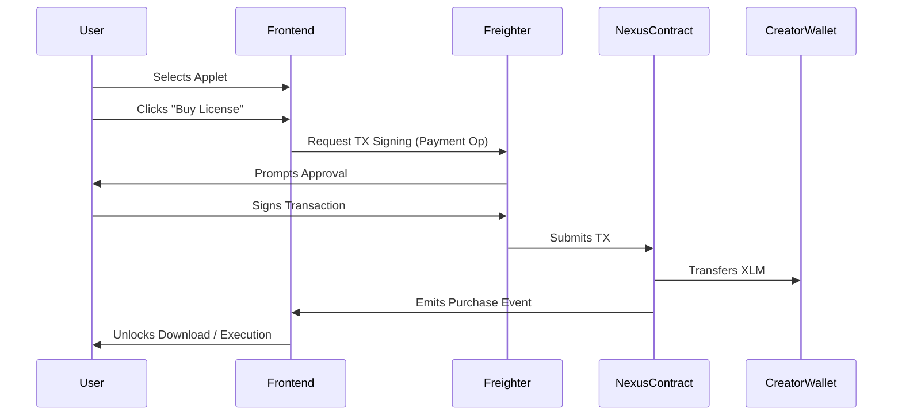

# Logic Marketplace Documentation

## Overview
The **Logic Marketplace** allows developers to publish, monetize, and discover verified Soroban Smart Contracts ("Applets"). It acts as the registry layer for the Stellar Nexus protocol, ensuring that all executable code is immutable and verified.

## 👥 Roles
1.  **Creators**: Developers who write Rust/WASM code, deploy it to Soroban, and list it on Nexus.
2.  **Consumers**: Developers or dApps that purchase execute rights or source code licenses.
3.  **Verifiers**: (Automated) The protocol checks the hash of the uploaded WASM against the source.

## 🔄 The Purchasing Flow



## 📋 Listing an Applet

To list an applet, you must invoke the `publish_listing` function on the Nexus Registry contract.

### Parameters
*   `wasm_hash` (Bytes32): The SHA-256 hash of the compiled `.wasm` file.
*   `metadata_uri` (String): IPFS link to description, author info, and documentation.
*   `price` (Int128): Price in Stroops (1 XLM = 10,000,000 Stroops).
*   `signature` (Bytes): Creator's signature proving ownership.

### Example (Rust SDK)
```rust
client.publish_listing(
    &wasm_hash,
    &"ipfs://QmYourMetadataHash",
    &10_000_000, // 1 XLM
    &signature
);
```

## 🔐 Verification System
Nexus enforces a "Verify-then-List" policy.
1.  **Source Match**: The uploaded WASM must match the compiled output of the provided GitHub repository.
2.  **Deterministic Builds**: We use Dockerized build environments to ensure binary reproducibility.
3.  **Security Scan**: Basic static analysis is performed to check for malicious opcodes.

## 💸 Fee Structure
*   **0% Platform Fee** (Beta): Creators receive 100% of the sale price.
*   **Gas Fees**: Users pay standard Soroban network fees (refundable if TX fails).
